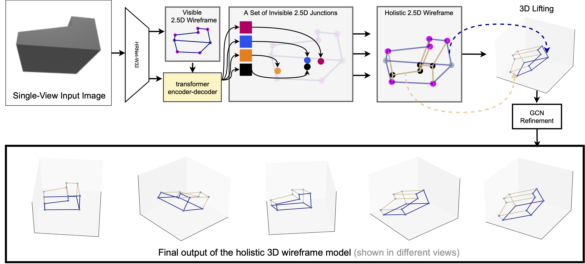

# HoW-3D: Holistic 3D Wireframe Perception from a Single Image

This is the official implementation code of our 3DV 2022 paper. 




## Getting Started
Clone the repository:
```shell
git clone https://github.com/Wenchao-M/HoW-3D.git
```

Install dependencies:
```shell
conda create -n how python=3.6
conda activate how
conda install pytorch torchvision cudatoolkit=10.0 -c pytorch

pip install -r requirement.txt
python setup.py build_ext --inplace
```

## Data Preparation

Please download our ABC-HoW dataset [here](https://drive.google.com/file/d/1NPNq4JDvV5p9Kli1acUZP05uzgKnrjUg/view?usp=sharing)
and place it under the 'data' folder.

## Training

Download the pretrained model of [HRNet](https://drive.google.com/drive/folders/1dCq4WxconPEDO8uZq4YDctZ8nxtvEtv8?usp=sharing) 
and place it under the 'ckpts/' folder.

We train our model in a four stage manner, run the following comman to train.
``` shell
bash train.sh
```

## Testing
You can download the pretrained model [here](https://drive.google.com/file/d/1j2lP_3ut1fGRUM7iYpSAtsx-NRijcOpF/view?usp=sharing) 
and place it under the 'ckpts/' folder. (Optional)

Change the 'resume_dir' in 'config_DSG_eval.yaml' to the path where you save the weight file.

Change the 'root_dir' in config files to the path where you save the data.

Run the following command to evaluate the performance:
```shell
CUDA_VISIBLE_DEVICES=0 python eval.py --cfg_path configs/config_DSG_eval.yaml

```
The results would be saved in the json file: 'results/result.json'

## Evaluation
We provide the evaluation code to evaluate our DSG model. Please do it after running the testing code.

Evaluate the 3D junction AP and line sAP:
```shell
python evaluation/sap3D_junctions.py --path results/results.json
python evaluation/sap3D_lines.py --path results/results.json
```

## Visualization (Please run it on a machine with graphical interface)
Install the open3d-python:
```shell
pip install open3d-python
```
Visualize ground truth:
```shell
python visualization/vis_gt.py
```

Visualize results of our DSG model:
```shell
python visualization/vis_dsg.py

```

## Visualization Demo


## Citations
If you find our work useful in your research, please consider citing:
```
@inproceedings{ma2022HoW3D,
title={HoW-3D: Holistic 3D Wireframe Perception from a Single Image},
author={Wenchao Ma and 
	Bin Tan and
	Nan Xue and
	Tianfu Wu and
	Xianwei Zheng and
	Gui-Song Xia},
booktitle = {International Conference on 3D Vision},
year={2022}
}
```

## Contact
[mawenchao@whu.edu.cn](mawenchao@whu.edu.cn)

[https://xuenan.net/](https://xuenan.net/)


